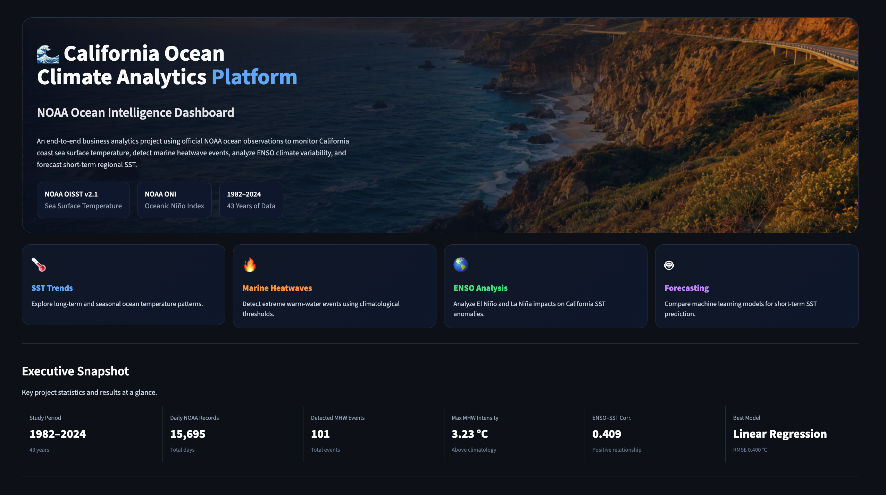
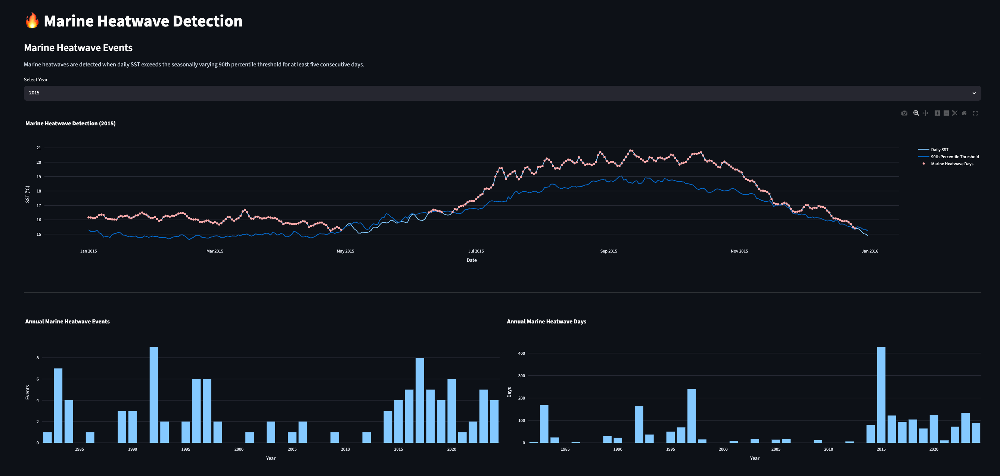
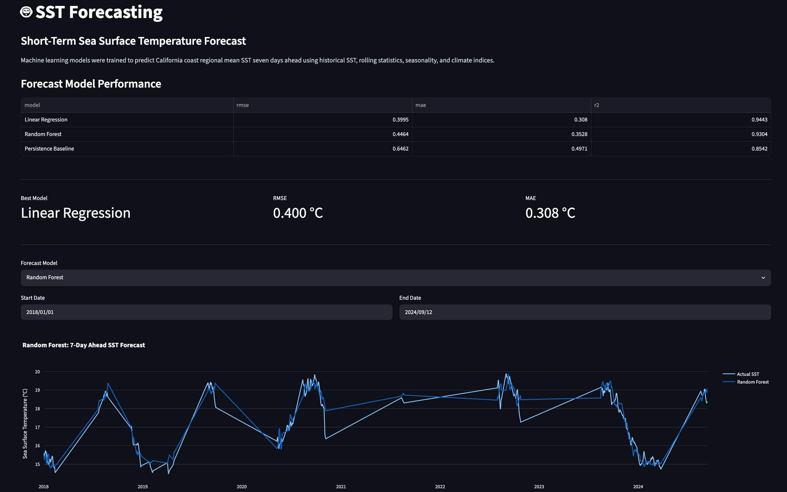

# 🌊 California Ocean Climate Analytics Platform

> **An end-to-end NOAA Ocean Intelligence Dashboard for monitoring California coast sea surface temperature, marine heatwaves, ENSO variability, and short-term SST forecasting.**

---

## Project Overview

This project transforms official NOAA ocean observations into an interactive analytics platform for exploring long-term sea surface temperature (SST) variability along the California coast.

The workflow includes:

- 🌡 Long-term SST trend analysis
- 🔥 Marine heatwave detection
- 🌎 ENSO (El Niño / La Niña) impact analysis
- 🤖 Machine learning-based SST forecasting
- 📊 Interactive Streamlit dashboard

The project was developed as a portfolio project for the **M.S. in Business Analytics** program at the **Rady School of Management, University of California San Diego**.

---

## Key Highlights

- Official NOAA OISST v2.1 observations (1982–2024)
- NOAA Oceanic Niño Index (ONI)
- 43 years of daily SST observations
- Automatic marine heatwave detection
- ENSO–SST relationship analysis
- Time-series machine learning forecasting
- Interactive Plotly + Streamlit dashboard

---

## Dashboard Modules

| Module              | Description                                             |
| ------------------- | ------------------------------------------------------- |
| 🌡 SST Trends       | Long-term warming, daily variability, seasonal cycle    |
| 🔥 Marine Heatwaves | Automatic detection and event statistics                |
| 🌎 ENSO Analysis    | El Niño / La Niña impacts and lag relationships       |
| 🤖 Forecasting      | 7-day SST prediction using machine learning             |
| ℹ About            | Data sources, methodology, architecture and future work |

---

# Dashboard Gallery

## Overview

<p align="center">

</p>

---

## Marine Heatwave Detection

<p align="center">

</p>

---

## Forecasting

<p align="center">

</p>

---

# Project Architecture

The project follows a reproducible end-to-end analytics workflow that transforms official NOAA ocean observations into an interactive decision-support platform.

```text
                    NOAA OISST v2.1
                 NOAA Oceanic Niño Index
                           │
                           ▼
                  Data Acquisition Scripts
                           │
                           ▼
                 Data Cleaning & Processing
                           │
                           ▼
            California Coast SST Aggregation
                           │
                           ▼
         Exploratory Data Analysis (EDA)
                           │
          ┌────────────────┼────────────────┐
          ▼                ▼                ▼
 Marine Heatwaves     ENSO Analysis    Feature Engineering
          │                │                │
          └────────────────┼────────────────┘
                           ▼
              Machine Learning Forecasting
                           │
                           ▼
            Interactive Streamlit Dashboard
```

---

## Repository Structure

```text
california-ocean-climate-analytics/

├── dashboard/                 # Streamlit dashboard
│   ├── app.py
│   ├── components.py
│   ├── data.py
│   ├── assets/
│   └── views/
│
├── notebooks/                 # Analysis notebooks
│   ├── 01_data_acquisition.ipynb
│   ├── 02_exploratory_data_analysis.ipynb
│   ├── 03_marine_heatwave.ipynb
│   ├── 04_enso_analysis.ipynb
│   └── 05_sst_forecasting.ipynb
│
├── scripts/                   # Executable scripts
│   └── download_data.py
│
├── src/                       # Core reusable modules
│   ├── download.py
│   ├── preprocess.py
│   ├── marine_heatwaves.py
│   ├── features.py
│   ├── modeling.py
│   ├── evaluation.py
│   ├── visualization.py
│   └── utils.py
│
├── data/
│   ├── processed/
│   └── raw/
│
├── docs/
│   └── images/
│
├── requirements.txt
└── README.md
```

---

# Data Sources

| Dataset                   | Source   | Description                   |
| ------------------------- | -------- | ----------------------------- |
| NOAA OISST v2.1           | NOAA PSL | Daily Sea Surface Temperature |
| Oceanic Niño Index (ONI) | NOAA CPC | Monthly ENSO index            |

> Raw NOAA NetCDF files are **not included** in this repository because of file size. The project provides automated download scripts for reproducing the workflow.

---


# Analytics Methods

## 1. Sea Surface Temperature Analysis

Daily NOAA OISST observations were spatially aggregated over the California coastal region to produce a regional mean sea surface temperature (SST) time series from **1982 to 2024**.

The analysis includes:

- Long-term SST trend analysis
- Daily SST variability
- Seasonal SST cycle
- Monthly SST anomalies
- Annual SST summaries

These analyses provide the climatological baseline for subsequent marine heatwave detection and forecasting.

---

## 2. Marine Heatwave Detection

Marine heatwave (MHW) events are identified using a climatology-based threshold approach.

### Workflow

1. Calculate the daily climatological SST.
2. Compute the daily 90th percentile threshold.
3. Calculate SST anomalies relative to climatology.
4. Detect periods where SST exceeds the threshold for **at least five consecutive days**.
5. Summarize each event using:

- Start date
- End date
- Duration
- Maximum intensity
- Mean intensity
- Cumulative intensity

The dashboard allows users to interactively explore individual marine heatwave events and long-term changes in marine heatwave frequency.

---

## 3. ENSO Analysis

To investigate large-scale climate forcing, monthly California SST anomalies are compared with the **NOAA Oceanic Niño Index (ONI)**.

Analyses include:

- ONI versus SST anomaly correlation
- ENSO phase comparison
- Lag correlation analysis
- Marine heatwave activity during El Niño, Neutral, and La Niña periods

These analyses quantify the relationship between Pacific climate variability and regional ocean warming.

---

## 4. Machine Learning Forecasting

The project develops machine learning models to forecast **7-day ahead regional mean SST**.

### Feature Engineering

Forecast models use:

- Lagged SST observations
- Rolling mean
- Rolling standard deviation
- Day of year
- Month
- Seasonal cycle
- NOAA ONI
- SST anomaly

### Forecast Models

- Persistence Baseline
- Linear Regression
- Random Forest
- XGBoost-ready pipeline

Models are evaluated using chronological train/test splitting together with time-series validation to avoid information leakage.

---

## 5. Model Evaluation

Forecast performance is evaluated using:

| Metric | Purpose                      |
| ------ | ---------------------------- |
| RMSE   | Root Mean Squared Error      |
| MAE    | Mean Absolute Error          |
| R²    | Coefficient of Determination |

The dashboard provides an interactive comparison of forecasting models together with actual versus predicted SST time series.

---

# Key Results

The project demonstrates several important findings.

### California SST

- California coastal SST exhibits clear seasonal variability together with an overall warming tendency during the study period.

### Marine Heatwaves

- Marine heatwave activity becomes substantially more frequent after the early 2010s.
- Several exceptionally long and intense marine heatwave events occurred during the 2014–2016 warm period.

### ENSO

- El Niño conditions are associated with warmer California SST anomalies.
- The strongest relationship occurs when ONI leads California SST anomalies by approximately two months.

### Forecasting

- Machine learning models outperform the persistence baseline.
- Linear Regression achieved the lowest RMSE in the current implementation.
- The forecasting pipeline provides accurate short-term SST prediction while remaining computationally efficient.

---


# Installation

## Clone the Repository

```bash
git clone https://github.com/rsm-shz142/california-ocean-climate-analytics.git

cd california-ocean-climate-analytics
```

---

## Install Dependencies

Create a Python environment (Python 3.11+ recommended) and install all required packages.

```bash
pip install -r requirements.txt
```

---

## Download NOAA Data

Run the automated download pipeline.

```bash
python scripts/download_data.py
```

This script automatically:

- Downloads NOAA OISST observations
- Downloads NOAA Oceanic Niño Index (ONI)
- Extracts California coastal SST
- Saves processed datasets for analysis

---

## Launch Dashboard

```bash
streamlit run dashboard/app.py
```

The dashboard includes:

- 🌡 SST Trends
- 🔥 Marine Heatwaves
- 🌎 ENSO Analysis
- 🤖 Forecasting
- ℹ Project Overview

---

# Reproducing the Analysis

All notebooks can be executed independently.

Recommended order:

```text
01_data_acquisition.ipynb

↓

02_exploratory_data_analysis.ipynb

↓

03_marine_heatwave.ipynb

↓

04_enso_analysis.ipynb

↓

05_sst_forecasting.ipynb
```

Each notebook builds upon the processed datasets generated by the download pipeline.

---

# Technologies Used

## Programming

- Python
- Pandas
- NumPy

## Scientific Computing

- Xarray
- NetCDF4
- h5netcdf

## Machine Learning

- Scikit-learn
- Random Forest
- Linear Regression
- XGBoost (pipeline ready)

## Visualization

- Plotly
- Matplotlib
- Streamlit

## Climate Data

- NOAA OISST v2.1
- NOAA CPC Oceanic Niño Index (ONI)

---

# Project Contributions

This project demonstrates experience in:

- End-to-end data engineering
- Climate data analytics
- Feature engineering
- Time-series forecasting
- Marine heatwave detection
- Interactive dashboard development
- Software project organization
- Scientific data visualization

These components were integrated into a reproducible analytics workflow suitable for environmental analytics and Blue Economy applications.

---


# Skills Demonstrated

This project demonstrates practical experience in the following areas.

## Data Engineering

- Automated NOAA data acquisition
- Scientific NetCDF processing
- Reproducible data pipelines
- Feature engineering for time-series analysis

---

## Data Analytics

- Exploratory data analysis (EDA)
- Statistical summaries
- Time-series visualization
- Climate variability analysis

---

## Climate Analytics

- Sea surface temperature analysis
- Marine heatwave detection
- Climatology construction
- SST anomaly calculation
- ENSO impact assessment
- Lag-correlation analysis

---

## Machine Learning

- Time-series forecasting
- Feature engineering
- Linear Regression
- Random Forest
- TimeSeriesSplit validation
- XGBoost-ready forecasting pipeline

---

## Dashboard Development

- Streamlit
- Plotly
- Interactive analytics dashboard
- Business-oriented visualization

---

## Software Engineering

- Modular Python architecture
- Reusable source code
- GitHub project organization
- Reproducible workflow

---

# Future Improvements

Future versions of this project may include:

- Full Hobday et al. (2016) moving-window climatology implementation
- Spatial marine heatwave detection for individual ocean grid cells
- XGBoost hyperparameter optimization
- LSTM and Transformer-based SST forecasting
- Cloud deployment of the Streamlit dashboard
- Automatic daily NOAA data synchronization
- Interactive geospatial visualizations

---

# Acknowledgements

This project uses publicly available datasets provided by:

- NOAA Physical Sciences Laboratory (PSL)
- NOAA National Centers for Environmental Information (NCEI)
- NOAA Climate Prediction Center (CPC)

The project was developed for educational and portfolio purposes.

---

# Author

**Shuning Zhang**

M.S. in Business Analytics

Rady School of Management

University of California San Diego

---

# Repository

GitHub Repository

https://github.com/rsm-shz142/california-ocean-climate-analytics

---

# License

This project is released under the MIT License.

See the LICENSE file for details.
